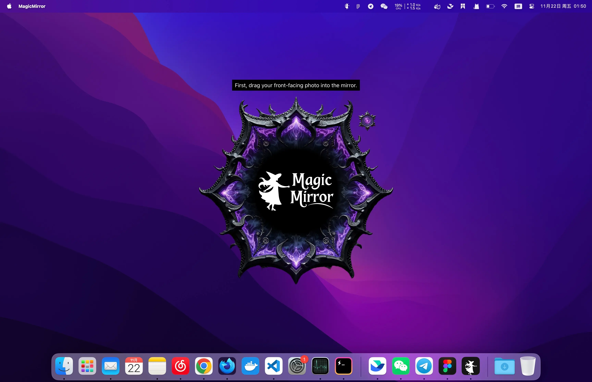
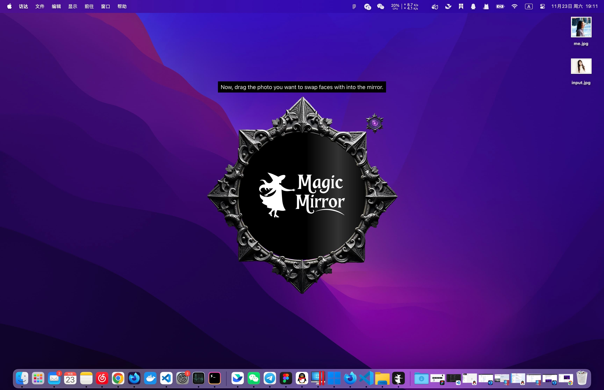
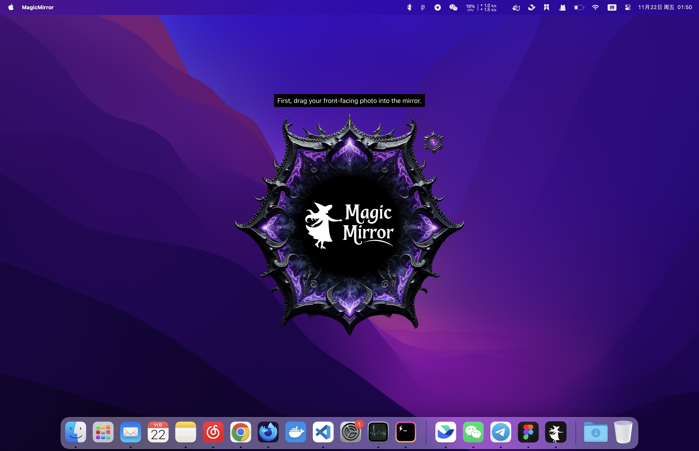
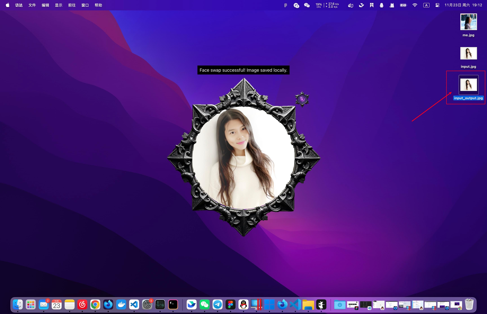

# Magic Mirror ✨

> Instant AI Face Swap, Hairstyles & Outfits — One click to a brand new you!

Magic Mirror 是一款跨平台的 AI 换脸应用，支持图片与视频的一键换脸，覆盖桌面端（Windows / macOS / Linux）、Web 端与 Android 端。

[](LICENSE)
[](https://react.dev)
[](https://tauri.app)
[](https://www.python.org)
[](https://developer.android.com)



---

## 📚 文档导航

| 中文 | English |
|---|
| [📖 详细介绍](docs/cn/readme.md) | — |
| [🔧 安装指南](docs/cn/install.md) | [🔧 Install Guide](docs/en/install.md) |
| [📘 使用教程](docs/cn/usage.md) | [📘 Usage Guide](docs/en/usage.md) |
| [❓ 常见问题](docs/cn/faq.md) | [❓ FAQ](docs/en/faq.md) |
| [🔌 API 文档](docs/API.md) | [🔌 API Docs](docs/API.md) |

---

## 🌟 功能特性

- **图片换脸**：单脸、多脸、区域换脸（手动选区精准换脸）
- **视频换脸**：基于 MediaCodec 的逐帧解码与重编码，支持音轨保留
- **多人脸源绑定**：一次任务为不同区域绑定不同人脸源
- **GPU 加速**：桌面端支持 CUDA / DirectML，自动检测可用提供者
- **Web 模式**：浏览器直接访问后端 API，无需安装客户端
- **多语言**：内置中文、英文等多语言切换（i18next）
- **隐私优先**：所有处理本地完成，不上传任何图片到第三方服务

---

## 🖼 效果预览

| 输入 | 人脸 | 结果 |
|:---:|:---:|:---:|
|  |  |  |

---

## 📦 项目结构

```
Magic-Mirror/
├── src/                # 前端 React + TypeScript（Vite + UnoCSS）
│   ├── pages/              # 页面（Mirror、Login 等）
│   ├── hooks/              # 自定义 Hooks（useSwapFace 等）
│   ├── services/           # API 客户端（Server / WebServerClient）
│   └── i18n/               # 多语言资源
├── src-python/             # Python 后端（Bottle + ONX Runtime）
│   ├── magic/              # 换脸核心模块（face、app）
│   └── web_server.py       # Web 模式 HTTP 服务（端口 8033）
├── src-tauri/              # T Rust 桌面壳
├── android-app/            # Android 原生应用（Java + ONX Runtime）
│   └── app/src/main/java/com/magicmirror/app/
│       └── engine/         # 端侧推理引擎（FaceSwapEngine、VideoProcessor 等）
├── docs/                   # 项目文档（中英双语 + API）
├── scripts/                # 构建脚本（build-server.sh、dist.js 等）
└── .github/workflows/      # CI / CD（构建桌面包、Web 包、Android APK）
```

---

## 🚀 快速开始

> 想直接下载安装包？请查看 [安装指南 / Install Guide](docs/cn/install.md)。

### 环境要求

- **Node.js**≥ 18，**pnpm** ≥ 8
- **Python** ≥ 3.10（带 pip）
- **Rust** ≥ 1.70（仅桌面端）
- **Android Studio** + **JDK 17**（仅 Android 端）

### 前端开发

```bash
# 安装依赖
pnpm install

# 启动开发服务器（默认端口 5173）
pnpm dev

# 生产构建
pnpm build
```

### Python 后端

```bash
cd src-python
pip install -r requirements.txt

# 启动桌面后端（端口 8023）
python -m magic.app

# 启动 Web 后端（端口 8033，带鉴权）
python web_server.py
```

模型文件需放在 `src-python/models/` 下，包括 `det_500m.onnx`、`w600k_r50.onnx`、`inswapper_128.onnx` 等。模型下载方式见 [安装指南](docs/cn/install.md)。

### Tauri 桌面端

```bash
# 开发模式
pnpm tauri dev

# 打包
pnpm tauri build
```

### Android 端

```bash
cd android-app
./gradlew assembleDebug
# 输出: android-app/app/build/outputs/apk/debug/app-debug.apk
```

---

## 🛠 技术栈

| 层 | 技术 |
|---|---|
| 前端 UI | React 18、TypeScript、UnoCSS、Vite |
| 状态管理 | xsta |
| 多语言 | i18next + react-i18next |
|桌面壳 | Tauri 2.0（Rust） |
| 后端 | Python 3.10、Bottle、ONNX Runtime |
| 模型 | InsightFace（det_500m + w600k_r50）+ inswapper_128 |
| Android | Java、ONNX Runtime Android、MediaCodec |
| CI/CD | GitHub Actions（多平台构建） |

---

## 🔐 Web 模式安全特性

`src-python/web_server.py` 内置生产级加固：

- **JWT 鉴权**：登录获取 token，所有 API 必须携带 `Authorization: Bearer <token>`
- **TL 垃圾回收**：上传 24h、结果 4h、进度 6h 自动清理
- **路径穿越防护**：`os.path.commonpath` 校验所有文件访问
- **文件名清洗**：正则过滤危险字符
- **上传大小限制**：图片 50MB / 视频 2GB
- **节流 GC**：`before_request` 钩子按需触发清理

---

## 📡 API 概览（Web 模式）

| Endpoint | 方法 | 说明 |
|---|---|---|
| `/api/login` | POST | 登录获取 token |
| `/api/upload` | POST | 上传图片 / 视频 |
| `/api/library` | GET / POST | 人脸库管理 |
| `/api/taskdetect-faces` | POST | 检测图片人脸框 |
| `/api/task/video/detect-faces` | POST | 检测视频关键帧人脸框 |
| `/api/task` | POST | 创建图片换脸任务 |
| `/api/task/video` | POST | 创建视频换脸任务 |
| `/api/task/video/progress/<id>` | GET | 查询视频任务进度 |
| `/api/task/<id>` | DELETE | 取消任务 |
| `/api/file/<id>` | GET | 获取结果文件 |
| `/api/download/<id>` | GET | 下载结果文件

完整字段定义、请求/响应示例与错误码见 [docs/API.md](docs/API.md)。

---

## ⚙️ 性能优化

- **桌面端**：GPU（CUDA / DirectML）加速，CPU 模式最多 6 worker，GPU 模式 2 worker
- **视频处理**：分段并行 + 关键帧追踪，多人换脸单 worker 顺序提交以保证时序一致
- **Android**：YUV ↔ RGB 转换使用定点整数运算 + bulk-copy，相对浮点逐像素实现快 5-15×
- **前端轮询**：自适应间隔（500ms - 2s）+ 指数退避，连续失败 8 次自动放弃
- **网络层**：所有 fetch 包装超时（默认 30s / 上传 10min / 进度 15s）

---

## 🤝 贡献

欢迎提交 Issue 与 Pull Request。提交代码前请先：

1. 运行 `pnpm build` 确保 TypeScript 通过
2. Python 端运行 `python -m pytest`（如有测试）
3. 遵循现有代码风格

---

## 📝 更新日志

历史版本变更见 [CHANGELOG.md](CHANGELOG.md)。

---

## 📄 License

[MIT License](LICENSE) © keggin

---

## 🙏 鸣谢

- [InsightFace](https://github.com/deepinsight/insightface) — 人脸检测与特征提取模型
- [inswapper](https://github.com/haofanwang/inswapper) — 换脸模型
- [Tauri](https://tauri.app) — 跨平台桌面框架
- [ONNX Runtime](https://onxruntime.ai) — 跨平台推理引擎
