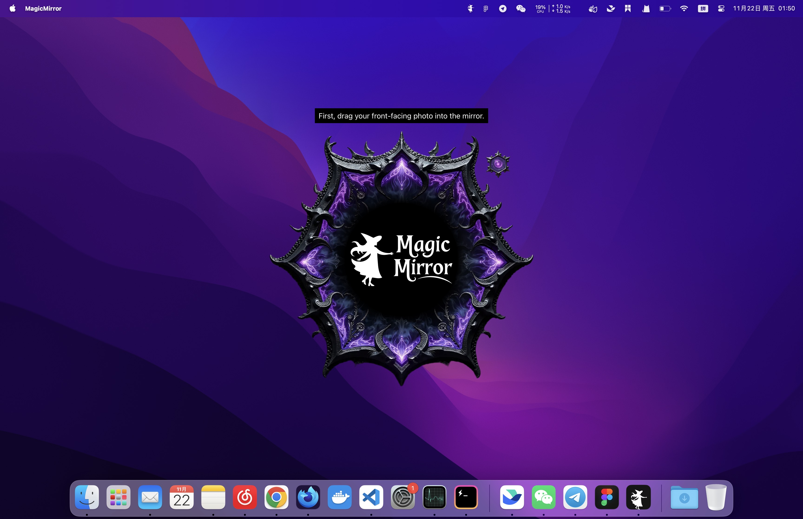
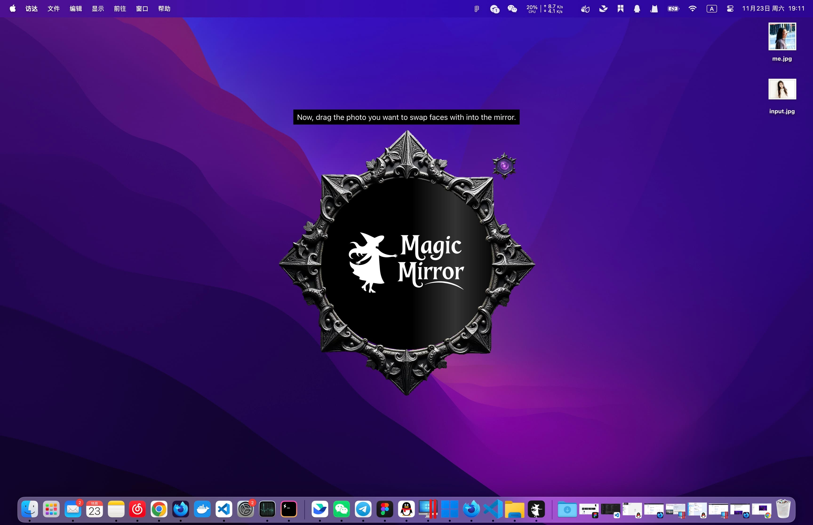
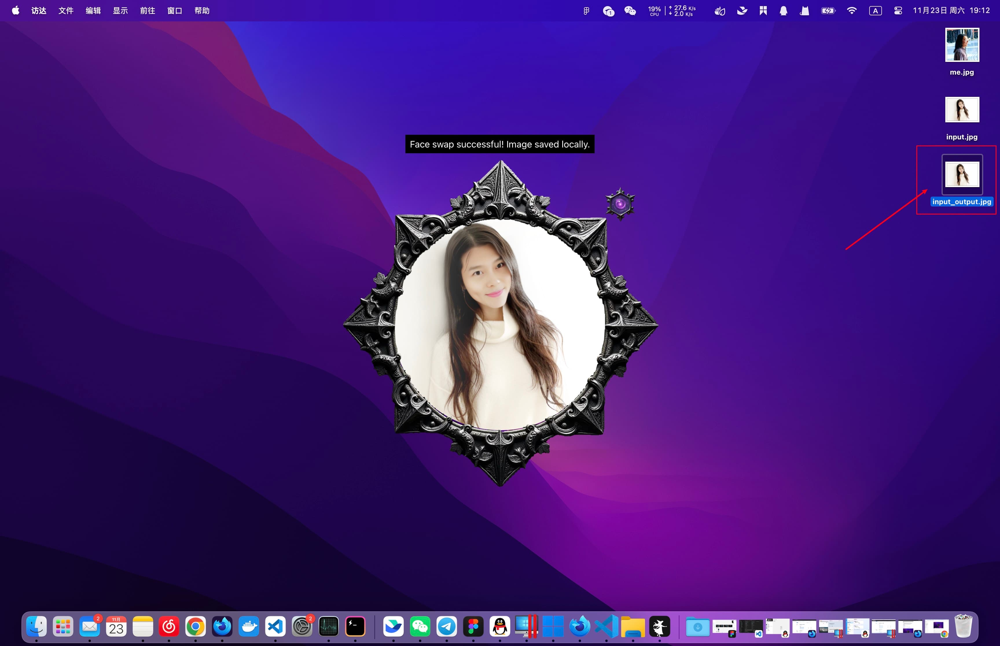
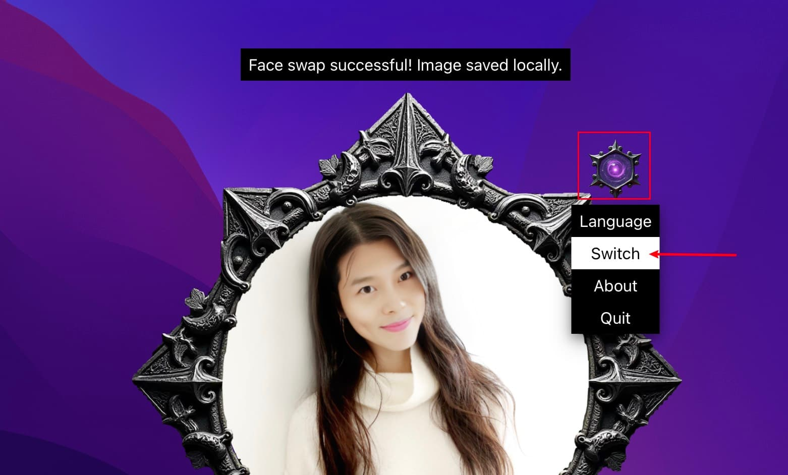

# 使用教程

首先，准备一张你的正脸照，然后拖入到镜子里。

然后把你想要换脸的照片，拖到另一面镜子里，等待换脸完毕即可。

> 苹果 M1 芯片换一张脸一般需要 3-5s 的时间，主要看你的电脑配置和图片大小

换脸成功后，会在原来的位置生成一张以 `_output` 结尾的新图片。

你可以继续拖入新的照片换脸，或通过右上角的菜单翻转镜像，更换新的脸部图片。

## 遇到问题？

大部分问题都能在「[常见问题](./faq.md)」里找到答案，如果你还有其他问题，请在此[提交反馈](https://github.com/idootop/MagicMirror/issues)。
