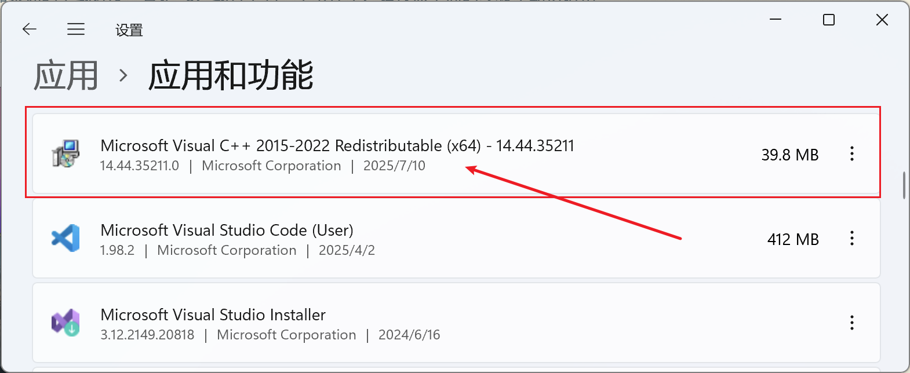
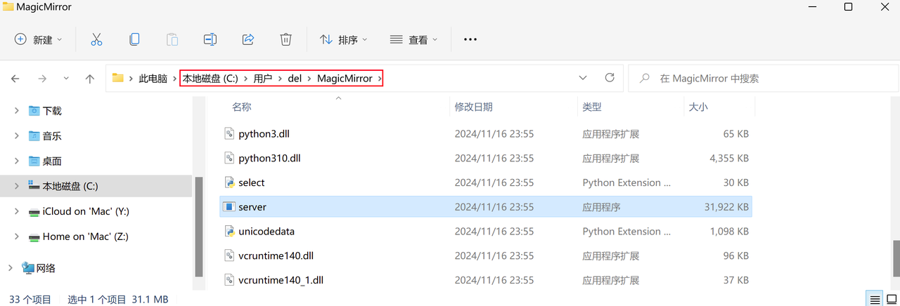
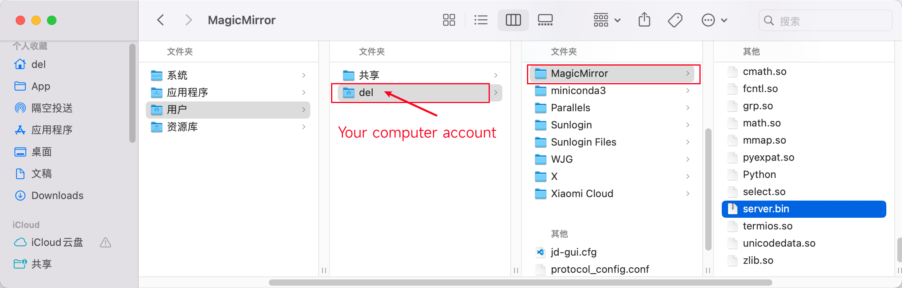

# Installation Guide


## Installation

Download and install the MagicMirror installer for your operating system:

1. Windows: [MagicMirror_1.0.0_windows_x86_64.exe](https://github.com/idootop/MagicMirror/releases/download/app-v1.0.0/MagicMirror_1.0.0_windows_x86_64.exe)
2. macOS: [MagicMirror_1.0.0_macos_universal.dmg](https://github.com/idootop/MagicMirror/releases/download/app-v1.0.0/MagicMirror_1.0.0_macos_universal.dmg)

## Install Dependencies (Windows)



For Windows users, you need to install the Microsoft Visual C++ Redistributable to run MagicMirror. Download it here: https://aka.ms/vs/17/release/vc_redist.x64.exe

## Download Models

When you first launch the app, it will automatically download the required model files.


If the download progress is stuck at 0% or stops midway, follow these steps for manual setup:

**Download Model Files**

Choose the model file that matches your operating system:

- [server_windows_x86_64.zip](https://github.com/idootop/MagicMirror/releases/download/server-v1.0.0/server_windows_x86_64.zip)
- [server_macos_x86_64.zip](https://github.com/idootop/MagicMirror/releases/download/server-v1.0.0/server_macos_x86_64.zip)

**Extract the Downloaded File**

You'll get a folder—rename it to `MagicMirror`. Move this folder to your computer's `HOME` directory, for example:





Restart MagicMirror, and it should now work properly.

## Launch APP

After downloading the model files, the first launch may take some time.


> The app should launch within 3 minutes. If it takes longer than 10 minutes to start, please refer to the [FAQ](./faq.md)

## Headless Linux Server Deployment (Ubuntu/Debian/CentOS/RHEL)

For supercomputing/server scenarios (no desktop required), deploy the web server and run tasks remotely.

### 1) Prepare bundle on server

Make sure your server directory contains:

- `web_server.dist/`
- `dist-web/`
- optionally a release archive such as `magicmirror_web_*.tar.gz` or `web_linux_x86_64.zip`

### 2) Run cross-distro installer

Use the Linux installer script:

```bash
sudo INSTALL_DIR=/opt/magicmirror \
  WEB_HOST=0.0.0.0 \
  WEB_PORT=21859 \
  WEB_UI_PORT=15129 \
  SERVICE_NAME=magic-mirror-web \
  SERVICE_USER=root \
  VIDEO_TASK_CONFIG_SECRET='replace-with-a-strong-secret' \
  bash ./scripts/install-server-linux.sh
```

Script path: `scripts/install-server-linux.sh`

What it does:

- auto-detects package manager (`apt` / `dnf` / `yum`)
- installs runtime dependencies (`ffmpeg`, `nginx`, OpenCV runtime libs, etc.)
- supports `systemd` service setup on modern Linux
- supports fallback `nohup` startup when `systemd` is unavailable
- configures reverse proxy: `UI -> /api -> WEB_PORT`

### 3) Service management (systemd)

If systemd exists:

```bash
sudo systemctl status magic-mirror-web --no-pager
sudo systemctl restart magic-mirror-web
sudo journalctl -u magic-mirror-web -f
```

### 4) Ports / firewall

Open both ports in your cloud security group and host firewall:

- `WEB_UI_PORT` (default `15129`) for browser UI
- `WEB_PORT` (default `21859`) for backend API (usually proxied behind UI)

### 5) “View Task ID Only” workflow (config-only)

When you enable **View Task ID Only (Do not run locally)** in UI:

- server creates a task config and returns `configId`
- no local execution happens
- later requests can submit this `configId` to execute on server

Current implementation also supports signed config tokens (with TTL), so config IDs can be reused without relying only on in-memory process state.
For production, always set a strong and stable `VIDEO_TASK_CONFIG_SECRET`.

### 6) Terminal-only mode for HPC (no exposed ports)

If your cluster cannot expose ports (SSH/Slurm only), use private mode:

```bash
sudo INSTALL_DIR=/opt/magicmirror \
  TERMINAL_ONLY_MODE=1 \
  WEB_HOST=127.0.0.1 \
  SKIP_NGINX=1 \
  VIDEO_TASK_CONFIG_SECRET='replace-with-a-strong-secret' \
  bash ./scripts/install-server-linux.sh
```

Then run the config directly from terminal without HTTP:

```bash
python3 ./scripts/run-task-config-cli.py \
  --config-id 'cfg1.xxxxx.yyyyy' \
  --input-video /path/to/input.mp4 \
  --target-face /path/to/face.jpg \
  --output /path/to/output.mp4
```

For multi-face config IDs, provide source mapping:

```bash
python3 ./scripts/run-task-config-cli.py \
  --config-id 'cfg1.xxxxx.yyyyy' \
  --input-video /path/to/input.mp4 \
  --face-source personA=/path/to/a.jpg \
  --face-source personB=/path/to/b.jpg \
  --output /path/to/output.mp4
```

You can also pass `--library-map-json /path/to/map.json`, where JSON is either:
- object: `{ "personA": "/path/a.jpg", "personB": "/path/b.jpg" }`
- list: `[{"id":"personA","path":"/path/a.jpg"}]`

### 7) Legacy / old Linux notes

- if `ffmpeg` is unavailable in default repos, install from your distro’s extra repo first
- if `nginx` is not desired, set `SKIP_NGINX=1`
- if `systemd` is missing, script falls back to background process + pid/log file under `data/web/`

## Need help?

Most issues are addressed in the [FAQ](./faq.md). If you need further assistance, please [submit an issue](https://github.com/idootop/MagicMirror/issues).
